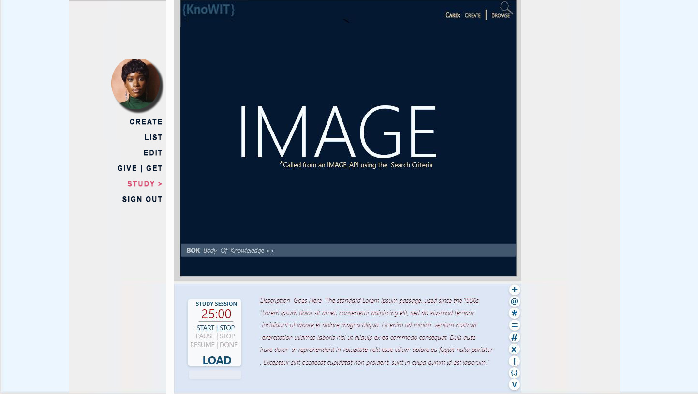
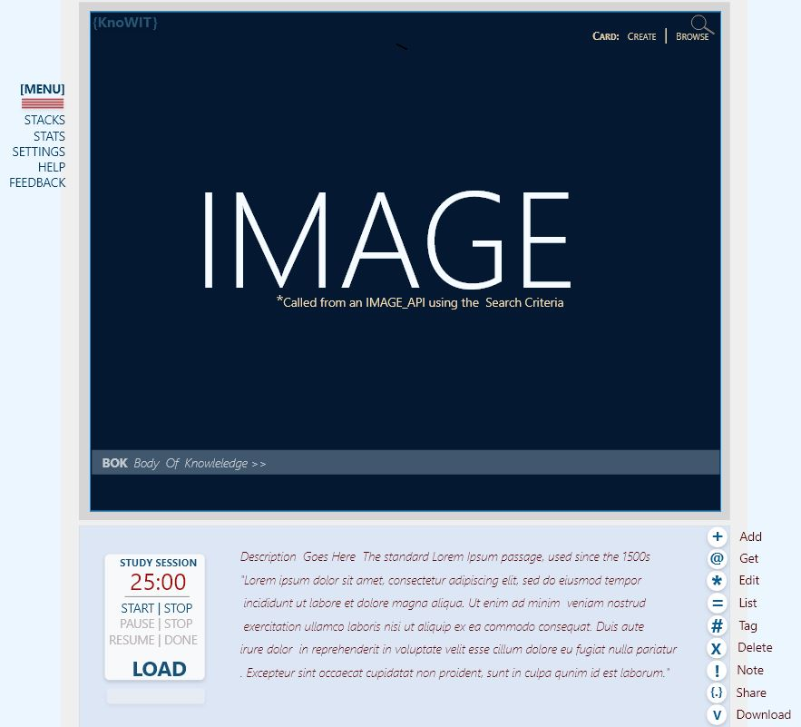
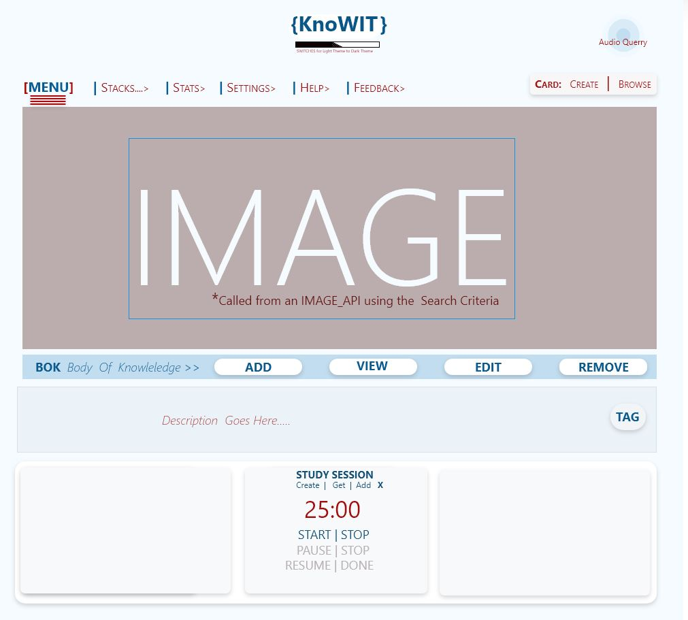

Project url: https://knowit.netlify.app/

Purpose: 
Students and professionals all around the world are looking for the most effective way to study and retain information. From complex fields of study such as Rocket Science, to Art and Literature, better retention of information is essential to all scholars.

KnoWit offers a mixture of two scientifically proven study tools, to make learning more intuitive.

1)Spaced repetition: https://en.wikipedia.org/wiki/Spaced_repetition

Invented in 1939 by H.F Spitzer, spaced repetition has been scientifically proven to be the most effective way to retain information. In short, when you are introduced to new information your brain keeps that information in your short term memory, and after a certain period of time the information fades. However if you continue to repetitively expose yourself to this information until it becomes part of your long term memory you are much less likley to forget it. KnoWit displays your information of study (information that you enter) as flashcards, but at specific intervals. based on the users performance, cards will repeat more frequently or less frequently, until the information is retained.

2)The Pomodora technique
https://en.wikipedia.org/wiki/Pomodoro_Technique

Invented in the 1980’s, the Pomodora technique is the most effective way to leverage your brain’s concentration. The brain is very powerful, however it needs rest periods to perform at the most optimum levels. Based on research developed by Francesco Cirillo, the most effective period of study time for you to retain information without a loss in performance, is 25 minutes. There are always sligth deviations from person to person, but this is the general range for the average person. KnoWit allows you to study your information while keeping you within this range, and giving you a break as soon as you hit this limit. (You can customize to fit your preferences of course)

Summary
With KnoWit, you can use scientifically proven techniques to learn and retain information, the most effective way possible. As you are exposed to new information, you enter it into your account, and study it within sessions created for your most optimum benefit.

Who KnoWit is designed for:
KnoWit is designed for anyone studying new information, like students, software engineers, law students etc.

Timeframe
Friday
Initialize repository
Create read me
Select api for project
Determine schedules: meet times: 12pm- 4pm- 10pm
Decide what app page layout structure will be
Test pushes for smooth collaboration with branches
Decide firebase implementation

Saturday
Connect firebase
Decide team roles and responsibilities
Decide component structure
Design full wireframe
Create all components

Mvp
Read me
Firebase
wireframe
Axios
Adobe xd
Spaced repetition flash cards 
Using Third party api

Team Responsibilities
Wireframe*
Login page design component
Create account component*
Nav bar design component*
Firebase Authentication
Home page structure*
Presentation

Stretch goals
Sessions
Pomodora Timer
Authentication
Favorites
Limits and delete function

Pages
Login page
Signup page
Home page

Technologies
React
Axios
React Router
Firebase
Netlify
Adobe xd

Team
Brian
Charles
Deji

## WireFRAME
#### User Authentication

#### User Experience DashBoard

#### Components Overview

#### Stretch Goals Features

